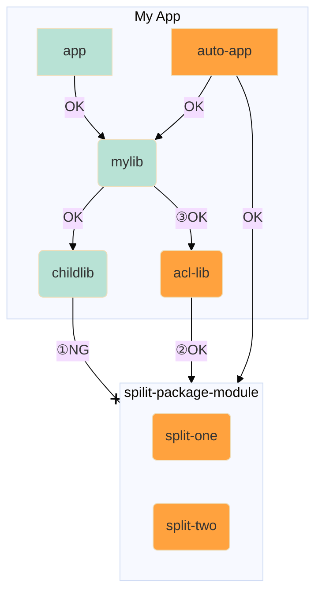

# hello-java-module

モジュールシステムを導入するときの名前付きモジュールと自動モジュールの組合せ､そしてSplit Packageの回避方法を示す｡

split packageが発生している自動モジュールを､名前付きモジュールから直接利用できない(①)｡  
回避方法として､split packageが発生しているモジュールを一旦自動モジュールでラップ(②)し､ラップした自動モジュールを名前付きモジュールから利用する(③)｡

(*): 腐敗防止層（ACL：Anti Corruption Layer）をイメージさせるのでACLモジュールと呼んでみたい｡

## Split Packageについて
> 依存性をモジュールとして扱い始めると、依存性はモジュール・システムによる細かいチェックを受けることになります。
> そして、このチェックは失敗する可能性もあります。 その例の1つが、JAR ファイルのSplit Packageです。
> これは、異なる２つのJARそれぞれで、同じパッケージで定義される型がある状況を指します。
> たとえば、`org.lib` というパッケージがあり、`foo.jar` に `org.lib.Foo` が、`bar.jar` に `org.lib.Bar` が定義されている場合です。
> モジュール・システムは、これを許可していないため、この2つのJARがモジュール・パス上に存在する場合、エラーが発生します｡

https://www.oracle.com/webfolder/technetwork/jp/javamagazine/Java-JA18-LibrariesToModules.pdf

## 参考
- [イマドキのJava徹底入門(5) Javaのモジュールシステムを理解しよう（その2） | TECH+（テックプラス）](https://news.mynavi.jp/techplus/article/imajava-5/)
- [2.1 Javaモジュールシステム（モジュール定義ファイル、モジュールパス、ルートモジュール、自動モジュール、無名モジュールなど）～Java Advanced編 #java8 - Qiita](https://qiita.com/KenyaSaitoh/items/a04a1e94d28153fd1afb)