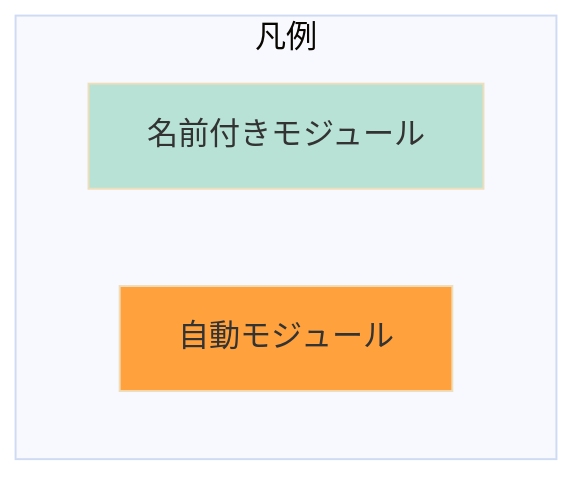
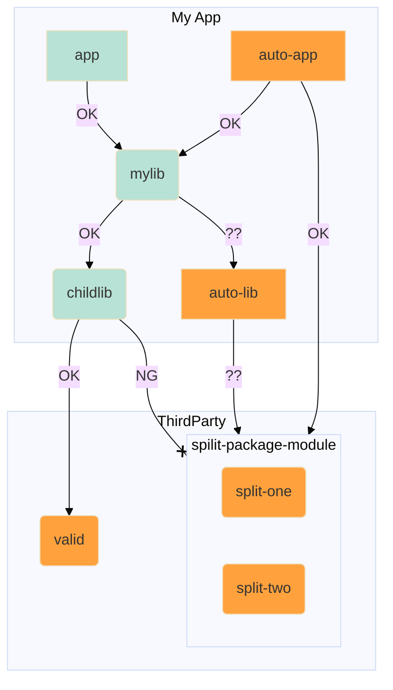

# hello-java-module

```mermaid
---
config:
  theme: base
---
graph TD;
    classDef namedModule fill:#7BCCAC,fill-opacity:0.5
    classDef autoModule  fill:#ffa23e

    subgraph 凡例 
        名前付きモジュール:::namedModule
        自動モジュール:::autoModule
    end
```

```mermaid
---
config:
  theme: base
---
graph TD;
    classDef namedModule fill:#7BCCAC,fill-opacity:0.5
    classDef autoModule  fill:#ffa23e

    subgraph "My App"
        myapp[app]:::namedModule
        mylib(mylib):::namedModule
        childlib(childlib):::namedModule
        autoapp[auto-app]:::autoModule
        autolib[auto-lib]:::autoModule
    end

    subgraph "ThirdParty"
        valid(valid):::autoModule
        
        subgraph "spilit-package-module"
            split-one(split-one):::autoModule
            split-two(split-two):::autoModule
        end
    end

    myapp --OK--> mylib;
    mylib --OK--> childlib;
    mylib --??--> autolib;

    childlib --OK--> valid;
    childlib --NG--x spilit-package-module;

    autoapp --OK--> mylib;
    autoapp --OK--> spilit-package-module;

    autolib --??--> spilit-package-module;
```
