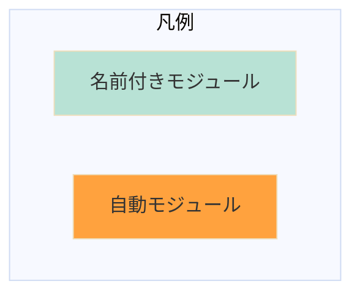
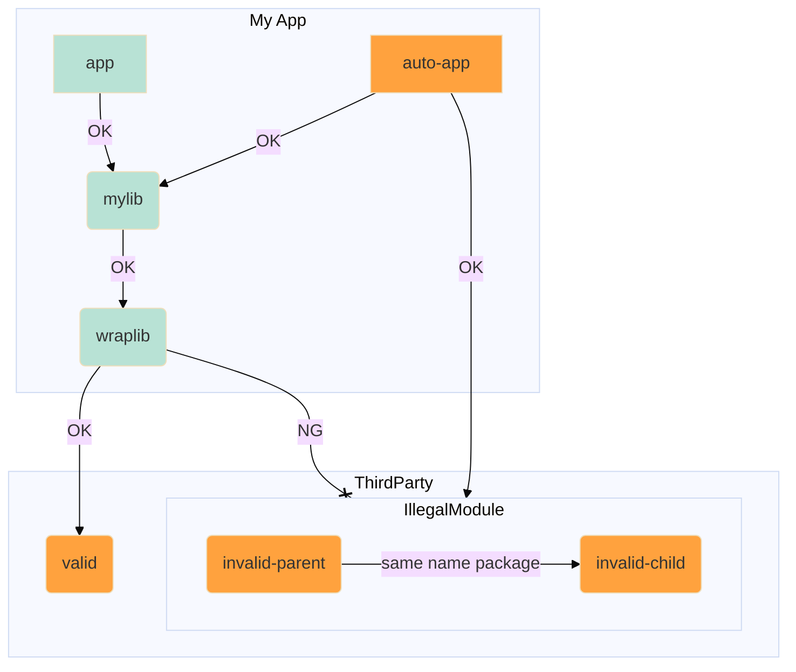

# hello-java-module

```mermaid
---
config:
  theme: base
---
graph TD;
    classDef namedModule fill:#7BCCAC,fill-opacity:0.5
    classDef autoModule  fill:#ffa23e

    subgraph 凡例 
        名前付きモジュール:::namedModule
        自動モジュール:::autoModule
    end
```

```mermaid
---
config:
  theme: base
---
graph TD;
    classDef namedModule fill:#7BCCAC,fill-opacity:0.5
    classDef autoModule  fill:#ffa23e

    subgraph "My App"
        myapp[app]:::namedModule
        mylib(mylib):::namedModule
        wraplib(wraplib):::namedModule
        autoapp[auto-app]:::autoModule
    end 

    subgraph "ThirdParty"
        valid(valid):::autoModule
        
        subgraph "IllegalModule"
            split-parent(invalid-parent):::autoModule
            split-child(invalid-child):::autoModule
        end
    end

    myapp --OK--> mylib;
    mylib --OK--> wraplib;
    wraplib --OK--> valid;
    wraplib --NG--x IllegalModule;

    autoapp --OK--> mylib;
    autoapp --OK--> IllegalModule;

    split-parent --same name package--> split-child;
```
